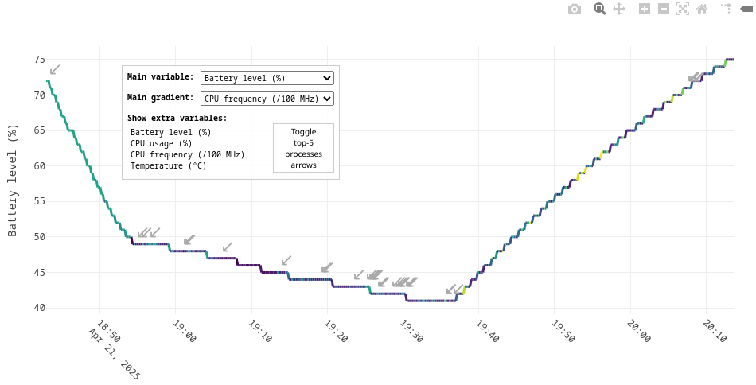
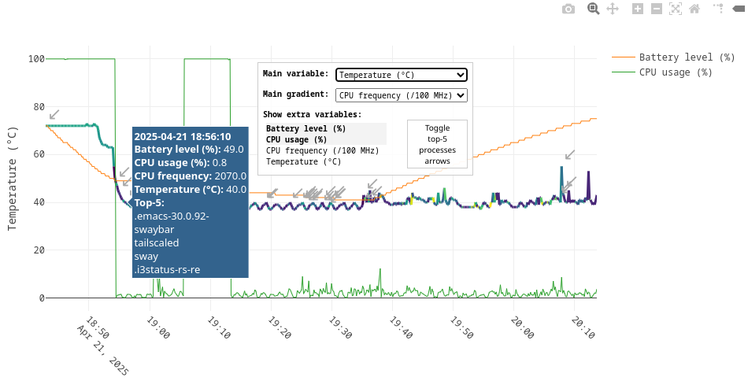

This repository contains three scripts to monitor and plot battery use, as well as constrain charging intervals to avoid overstressing the battery with full charges or full discharges.

- *`charge-control`*: set minimal and maximal battery levels within which charging is allowed, and a poweroff threshold; the method used to control charging is primarily made for smartphones and may not be exposed in other devices
- *`syslog`*: log battery level, temperature, CPU use and frequency, and most CPU-intensive processes over time to a CSV file
- *`plot-syslog.py`*: plot the CSV file as an interactive graph

## How to use

Clone this repository with `git clone URL` or download just the script(s) you need, then check usage for each individual script:

---

### `charge-control`

Root permissions are required to write to `uevent` and activate or deactivate charge, this script must therefore be executed with `sudo`.

```
Usage: sudo ./charge-control [-d DEACTIVATION] [-r REACTIVATION] [-f FREQUENCY] [-p POWEROFF] [-a ANIMATION] [-b BATTERY]

Options:
  -d DEACTIVATION  battery percentage at which charge is disabled (default: 90)
  -r REACTIVATION  battery percentage at which charge is enabled (default: 75)
  -f FREQUENCY     monitoring frequency of battery level (default: 10s)
  -p POWEROFF:     battery percentage at which the device is powered off (default: 10)
  -a ANIMATION     monitoring animation, 1, 2, 3 or 4, in decreasing CPU usage order (default: 2)
  -b BATTERY       battery name as referred to in /sys/class/power_supply/ (default: BAT0)
  -h               show this help

All arguments are optional. Values can be provided as positional arguments in that order
if not prefixed with flags, or provided in any order if prefixed with flags.
```

###### Example output

```
● Charge control enabled
  Charge deactivation level: 90%
  Charge reactivation level: 75%
  Monitoring frequency: 10
  Auto power-off level: 10%
  ▪ Charge enabled until battery reaches 90% (20:29)
  ▪ Charge disabled until battery drops to 75% (21:02)
  ⣷ Monitoring battery level...
```

---

### `syslog`

```
syslog allows monitoring battery level and CPU usage and speed over time.

Usage: ./syslog [-f FILE] [-i INTERVAL]

Options:
  -f FILE       file to log data to (default: ~/battery-log.csv)
  -i INTERVAL   log frequency, set as a duration (default: 60s)
  -b BATTERY    battery name as referred to in /sys/class/power_supply/ (default: BAT0)
  -h            show this help

All arguments are optional. Values can be provided as positional arguments in that order
if not prefixed with flags, or provided in any order if prefixed with flags.
```

###### Example syslog CSV file

```csv
Timestamp;Battery level (%);CPU usage (%);CPU frequency;Temperature (°C);Top-5 processes
2025-04-21T17:45:28+02:00;97;1.9%;1.10 GHz;39.2;chromium, chromium, chromium, chromium, chromium
2025-04-21T17:46:28+02:00;97;0.7%;2.92 GHz;39.4;chromium, chromium, chromium, chromium, chromium
2025-04-21T17:47:28+02:00;97;100.0%;544 MHz;40.4;stress, stress, stress, stress, stress
2025-04-21T17:48:28+02:00;96;100.0%;3.29 GHz;56.1;stress, stress, stress, stress, stress
2025-04-21T17:49:28+02:00;96;99.8%;3.29 GHz;62.0;stress, stress, stress, stress, stress
2025-04-21T17:50:28+02:00;96;100.0%;3.29 GHz;64.3;stress, stress, stress, stress, stress
2025-04-21T17:51:28+02:00;95;100.0%;3.69 GHz;74.1;stress, stress, stress, stress, stress
2025-04-21T17:52:28+02:00;95;1.5%;3.52 GHz;57.3;bwrap, guix, chromium, QtWebEngineProc, stremio
2025-04-21T17:53:28+02:00;95;0.6%;2.23 GHz;49.9;bwrap, chromium, QtWebEngineProc, guix, stremio
2025-04-21T17:54:28+02:00;95;1.8%;1.10 GHz;46.5;bwrap, chromium, QtWebEngineProc, stremio, guix
2025-04-21T17:55:28+02:00;94;1.5%;1.10 GHz;44.6;bwrap, chromium, QtWebEngineProc, stremio, guix
2025-04-21T17:56:28+02:00;94;1.9%;1.10 GHz;45.0;bwrap, chromium, QtWebEngineProc, R, guix
```

---

### `plot-syslog.py`

```
usage: ./plot-syslog.py [-h] [-i INPUT]

Generate battery level plot from a syslog log file

options:
  -h, --help               show this help message and exit
  -i INPUT, --input INPUT  input CSV file
```

###### Example plots

[](demo/plot-syslog-example.html)
[](demo/plot-syslog-example.html)
